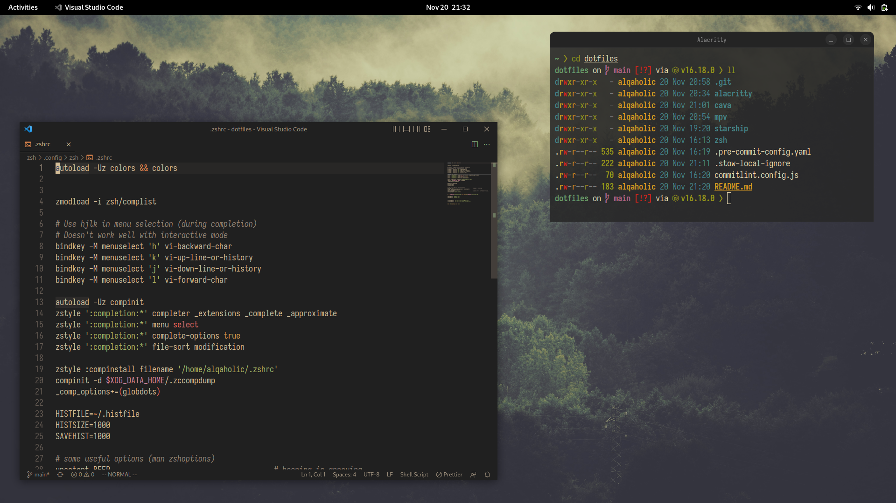

# Dotfiles

### Setup

- Clone this repo with `git clone --recurse-submodules https://github.com/AlQa-hOlic/dotfiles.git`
- Run `stow -nvv */` to preview changes before actually modifying the filesystem
- Run `stow */` to symlink everything
- Run `stow zsh` or any other top-level directory to symlink individual configs
